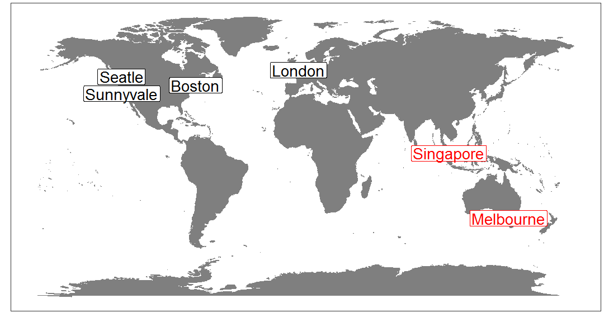
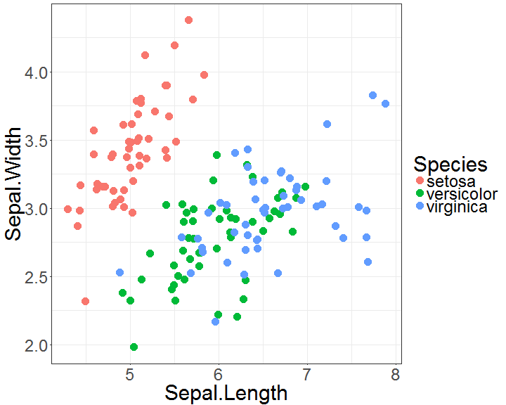
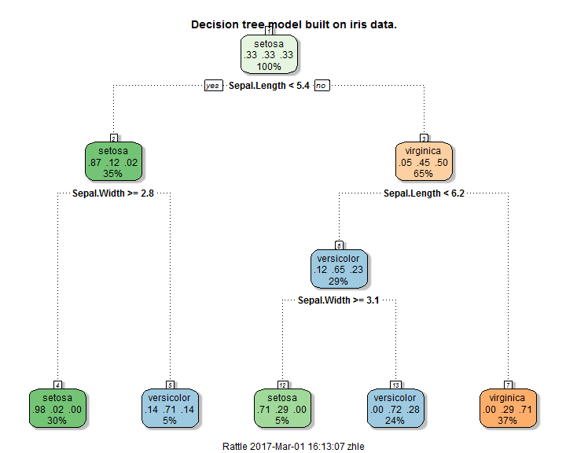
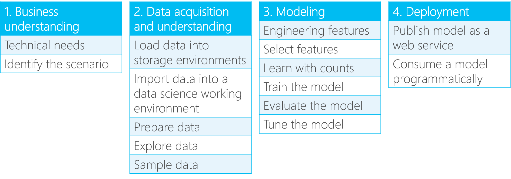
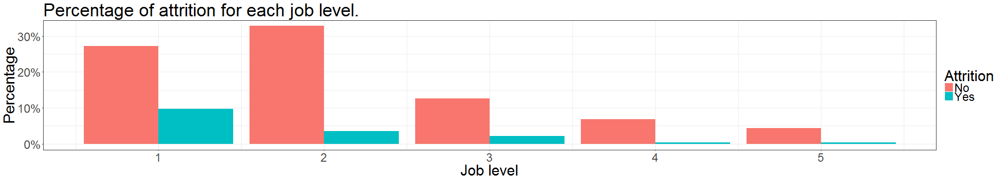
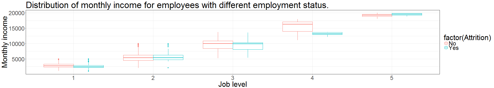
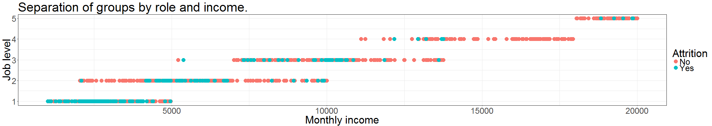
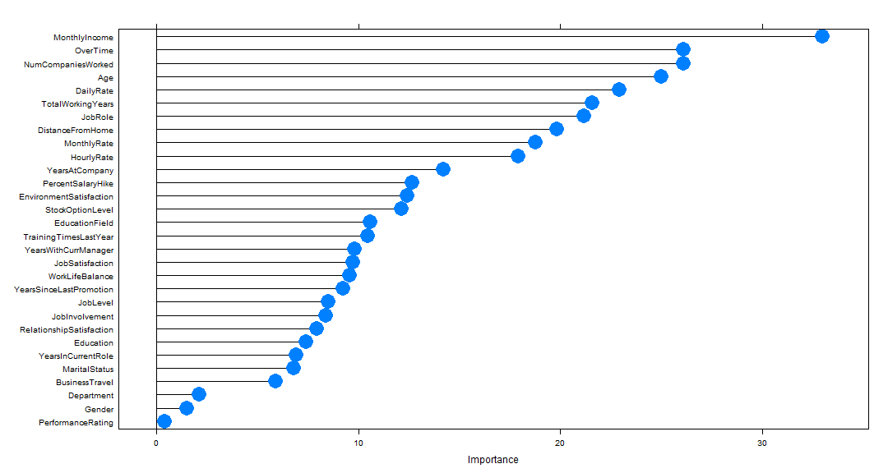

Employee Attrition Prediction with R Accelerator
========================================================
author: Le Zhang, Data Scientist at Microsoft
date: 2017-03-01
width: 1600
height: 1000

Agenda
========================================================


- Introduction.
- Employee attrition prediction with sentiment analysis.
- Walk-through of an R "accelerator".

Introduction
========================================================

- Microsoft Algorithms and Data Science (ADS).
- ADS Asia Pacific. 
    - Data science accelerators to resolve real-world problems.
    - Scalable tools & algorithms for advanced analytics.



Data science and machine learning
========================================================

<<<<<<< HEAD
- Data science & Machine learning
- A review on iris.



- Use cases: predictive maintenance, churn prediction, etc.

General work flow
========================================================

Microsoft Team Data Science Process

Use case - employee attrition prediction
========================================================

- Voluntary and involuntary.
- Consequences of employee attrition.
    - Loss of human resources.
    - Cost on new hires.
    - Potential loss of IP.
=======
- Data science & Machine learning.
- An illustration on iris data set.


- Use cases: predictive maintenance, demand forecasting, churn prediction, etc.
>>>>>>> parent of 8ca27fd... Revert "New pic for employee attrition illustration"
    
General work flow
========================================================

- Team Data Science Process (TDSP)
- Github repo: https://github.com/Azure/Microsoft-TDSP

    

Use case - employee attrition prediction
========================================================

    

- Voluntary and involuntary.
- Consequences of employee attrition.
    - Loss of human resources and cost on new hires.
    - Potential loss of company intellectual properties.
- Problem formalization
    - to identify employees with inclination of leaving.

Data collection, exploration, and preparation
========================================================

- historical records of each employee.
    - Time series.
    - Aggregated data.
    - Unstructured data.
- Labelled by employment status.

|Categories|Description|Factors|
|-----------|-------------------|------------------|
|Static|All sorts of demographic data, data that changes deterministically over time, etc.|Age, gender, years of service, etc.|
|Dynamic|Data that evolves over time, temporary data, etc.|Performance, salary, working hour, satifcation of job, social media posts, etc.|

Data collection, exploration, and preparation
========================================================

- Data source 
    - Employee attrition data: https://community.watsonanalytics.com/wp-content/uploads/2015/03/WA_Fn-UseC_-HR-Employee-Attrition.xlsx
    - Text data: http://www.glassdoor.com


```

  No  Yes 
1233  237 
```

- A glimpse at static data.


```
   Age Gender                   JobRole YearsAtCompany Attrition
1   49   Male        Research Scientist             10        No
2   33 Female        Research Scientist              8        No
3   27   Male     Laboratory Technician              2        No
4   32   Male     Laboratory Technician              7        No
5   59 Female     Laboratory Technician              1        No
6   30   Male     Laboratory Technician              1        No
7   38   Male    Manufacturing Director              9        No
8   36   Male Healthcare Representative              7        No
9   35   Male     Laboratory Technician              5        No
10  29 Female     Laboratory Technician              9        No
```

Data collection, exploration, and preparation
========================================================



Data collection, exploration, and preparation
========================================================

Sentiment analysis

- Examples
    - Scoring
        - How do you feel about the job?
        - Do you have work-life balance?
        - How is the relationship with colleagues?
    - Posts on social media
        1. The work you have done is so cool!
        2. I do not think I am needed in the company...

Feature Extraction
========================================================

- Static data - ready for use.
- Dynamic data
    - Data aggregation.
        - Time series characteristics.
        - Statistical measures.
    - Unstructured data.
        - Natural language process.
    
Feature Extraction (Cont'd)
========================================================

- Statistical measures
    - max, min, standard deviation, etc.
- Time series characterization.
    - Trend analysis.
    - Peak detection.
    - Time series model (ARIMA, etc.)
- Feature selection.

Model creation and validation
========================================================

- Model selection
    - Logistic regression.
    - Support vector machine.
    - Decision tree.
- Ensemble methods
    - Bagging (bootstrap aggregating).
    - Boosting.
    - Stacking.
- Model training
    - Data partition.
    - Resampling.
    
Model creation and validation
========================================================

- Cross validation.
- Confusion matrix.
    - Precision.
    - Recall.
    - F Score.
    - ...

Employee attrition prediction - R accelerator
========================================================

- What is an R "accelerator"
    - Lightweight end-to-end solution template.
    - Follows Microsoft Team Data Science Process (TDSP) format, in a simplified version.
    - Easy for prototyping, presenting, and documenting.
    - Github repo https://github.com/Microsoft/acceleratoRs

Step 0 Setup
========================================================

R session for the employee attrition prediction accelerator.


```
R version 3.3.2 (2016-10-31)
Platform: x86_64-w64-mingw32/x64 (64-bit)
Running under: Windows 10 x64 (build 14393)

attached base packages:
[1] grid      stats     graphics  grDevices utils     datasets  methods  
[8] base     

other attached packages:
 [1] maps_3.1.1           ggmap_2.6.1          scales_0.4.1        
 [4] jsonlite_1.1         XML_3.98-1.4         httr_1.2.1          
 [7] tm_0.6-2             NLP_0.1-9            rattle_4.1.0        
[10] e1071_1.6-7          pROC_1.8             caretEnsemble_2.0.0 
[13] caret_6.0-70         ggplot2_2.2.1        DMwR_0.4.1          
[16] readr_0.2.2          stringi_1.1.2        stringr_1.1.0       
[19] magrittr_1.5         dplyr_0.5.0          knitr_1.14.12       
[22] RevoUtilsMath_10.0.0 RevoUtils_10.0.2     RevoMods_10.0.0     
[25] MicrosoftML_1.0.0    mrsdeploy_1.0        RevoScaleR_9.0.1    
[28] lattice_0.20-34      rpart_4.1-10        

loaded via a namespace (and not attached):
 [1] splines_3.3.2          foreach_1.4.3          gtools_3.5.0          
 [4] assertthat_0.1         TTR_0.23-1             highr_0.6             
 [7] sp_1.2-3               stats4_3.3.2           slam_0.1-35           
[10] quantreg_5.26          chron_2.3-47           digest_0.6.10         
[13] RColorBrewer_1.1-2     minqa_1.2.4            colorspace_1.2-7      
[16] Matrix_1.2-7.1         plyr_1.8.4             SparseM_1.7           
[19] gdata_2.17.0           jpeg_0.1-8             lme4_1.1-12           
[22] MatrixModels_0.4-1     tibble_1.2             mgcv_1.8-15           
[25] car_2.1-2              ROCR_1.0-7             pbapply_1.2-1         
[28] nnet_7.3-12            lazyeval_0.2.0         proto_1.0.0           
[31] pbkrtest_0.4-6         quantmod_0.4-5         evaluate_0.10         
[34] nlme_3.1-128           MASS_7.3-45            gplots_3.0.1          
[37] xts_0.9-7              class_7.3-14           tools_3.3.2           
[40] CompatibilityAPI_1.1.0 data.table_1.9.6       geosphere_1.5-5       
[43] RgoogleMaps_1.4.1      rpart.plot_2.1.0       kernlab_0.9-25        
[46] munsell_0.4.3          caTools_1.17.1         nloptr_1.0.4          
[49] iterators_1.0.8        RGtk2_2.20.31          rjson_0.2.15          
[52] labeling_0.3           bitops_1.0-6           gtable_0.2.0          
[55] codetools_0.2-15       abind_1.4-3            DBI_0.5-1             
[58] curl_2.2               reshape2_1.4.2         R6_2.2.0              
[61] gridExtra_2.2.1        zoo_1.7-13             KernSmooth_2.23-15    
[64] parallel_3.3.2         Rcpp_0.12.7            mapproj_1.2-4         
[67] png_0.1-7             
```

Step 1 Data exploration
========================================================

- Employee attrition data.


```r
dim(df1)
```

```
[1] 1470   33
```

- Review comments data.


```r
dim(df2)
```

```
[1] 500  34
```


```r
head(df2$Feedback, 3)
```

```
[1] "People are willing to share knowledge which is not the norm in this industry This is the first place I have worked where the people are great about that Also I get to work on cool projects that no one else in the world works on"
[2] "To repeat what I wrote before the people I work for and work with here are very smart and confident people"                                                                                                                         
[3] "The variety of different projects and the speed of completion I am truly very satisfied  pleased there is an endless list of pros"                                                                                                  
```

Step 2 Data preprocessing
========================================================


```r
# get predictors that has no variation.

pred_no_var <- names(df1[, nearZeroVar(df1)]) %T>% print()
```

```
[1] "EmployeeCount" "StandardHours"
```


```r
# remove the zero variation predictor columns.

df1 %<>% select(-one_of(pred_no_var))
```

Step 2 Data preprocessing (Cont'd)
========================================================


```r
# convert certain interger variable to factor variable.

int_2_ftr_vars <- c("Education", "EnvironmentSatisfaction", "JobInvolvement", "JobLevel", "JobSatisfaction", "NumCompaniesWorked", "PerformanceRating", "RelationshipSatisfaction", "StockOptionLevel")

df1[, int_2_ftr_vars] <- lapply((df1[, int_2_ftr_vars]), as.factor)
```


```r
# convert remaining integer variables to be numeric.

df1 %<>% mutate_if(is.integer, as.numeric)
```


```r
df1 %<>% mutate_if(is.character, as.factor)
```

Step 2 Feature extraction
========================================================

Select salient features with a pre-trained model.


```r
control <- trainControl(method="repeatedcv", number=3, repeats=1)

# train the model

model <- train(dplyr::select(df1, -Attrition), 
               df1$Attrition,
               data=df1, 
               method="rf", 
               preProcess="scale", 
               trControl=control)
```

Step 2 Feature extraction (Cont'd)
========================================================


```r
# estimate variable importance

imp <- varImp(model, scale=FALSE)

plot(imp, cex=3)
```



Step 2 Feature extraction (Cont'd)
========================================================


```r
# select the top-ranking variables.

imp_list <- rownames(imp$importance)[order(imp$importance$Overall, decreasing=TRUE)]

# drop the low ranking variables. Here the last 3 variables are dropped. 

top_var <- 
  imp_list[1:(ncol(df1) - 3)] %>%
  as.character() 

top_var
```

```
 [1] "MonthlyIncome"            "OverTime"                
 [3] "NumCompaniesWorked"       "Age"                     
 [5] "DailyRate"                "TotalWorkingYears"       
 [7] "JobRole"                  "DistanceFromHome"        
 [9] "MonthlyRate"              "HourlyRate"              
[11] "YearsAtCompany"           "PercentSalaryHike"       
[13] "EnvironmentSatisfaction"  "StockOptionLevel"        
[15] "EducationField"           "TrainingTimesLastYear"   
[17] "YearsWithCurrManager"     "JobSatisfaction"         
[19] "WorkLifeBalance"          "YearsSinceLastPromotion" 
[21] "JobLevel"                 "JobInvolvement"          
[23] "RelationshipSatisfaction" "Education"               
[25] "YearsInCurrentRole"       "MaritalStatus"           
[27] "BusinessTravel"           "Department"              
```

Step 3 Resampling
========================================================


```r
train_index <- 
  createDataPartition(df1$Attrition,
                      times=1,
                      p=.7) %>%
  unlist()

df1_train <- df1[train_index, ]
df1_test <- df1[-train_index, ]
```


```r
table(df1_train$Attrition)
```

```

 No Yes 
864 166 
```

Step 3 Resampling (Cont'd)
========================================================


```r
df1_train %<>% as.data.frame()

df1_train <- SMOTE(Attrition ~ .,
                  df1_train,
                  perc.over=300,
                  perc.under=150)
```


```r
table(df1_train$Attrition)
```

```

 No Yes 
747 664 
```

Step 4 Model building
========================================================


```r
# initialize training control. 
tc <- trainControl(method="boot", 
                   number=3, 
                   repeats=3, 
                   search="grid",
                   classProbs=TRUE,
                   savePredictions="final",
                   summaryFunction=twoClassSummary)
```

Step 4 Model building (Cont'd)
========================================================

Let's try several machine learning algorithms.

- Support vector machine.


```r
# SVM model.

time_svm <- system.time(
  model_svm <- train(Attrition ~ .,
                     df1_train,
                     method="svmRadial",
                     trainControl=tc)
)
```

Step 4 Model building (Cont'd)
========================================================

- Random forest model.


```r
# random forest model

time_rf <- system.time(
  model_rf <- train(Attrition ~ .,
                     df1_train,
                     method="rf",
                     trainControl=tc)
)
```

Step 4 Model building (Cont'd)
========================================================

- Extreme gradient boosting model.


```r
# xgboost model.

time_xgb <- system.time(
  model_xgb <- train(Attrition ~ .,
                     df1_train,
                     method="xgbLinear",
                     trainControl=tc)
)
```

Step 4 Model building (Cont'd)
========================================================

An ensemble may be better?


```r
# ensemble of the three models.

time_ensemble <- system.time(
  model_list <- caretList(Attrition ~ ., 
                          data=df1_train,
                          trControl=tc,
                          methodList=c("svmRadial", "rf", "xgbLinear"))
)
```


```r
# stack of models. Use glm for meta model.

model_stack <- caretStack(
  model_list,
  metric="ROC",
  method="glm",
  trControl=tc
)
```

Step 5 Model evaluating
========================================================

Evaluating models with confusion matrix.


```r
predictions <-lapply(models, 
                     predict, 
                     newdata=select(df1_test, -Attrition))
```


```r
# confusion matrix evaluation results.

cm_metrics <- lapply(predictions,
                     confusionMatrix, 
                     reference=df1_test$Attrition, 
                     positive="Yes")
```

Step 5 Model evaluating (Cont'd)
========================================================

Comparison of different models in terms of .


```
         Models  Accuracy    Recall Precision Elapsed
1       SVM RBF 0.8613636 0.8028169 0.5480769   27.69
2 Random Forest 0.9113636 0.8169014 0.6904762  220.19
3       Xgboost 0.8977273 0.7887324 0.6511628  290.05
4      Stacking 0.9227273 0.8732394 0.7126437   84.36
```

Step 6 Sentiment analysis - a glimpse
========================================================

```r
# getting the data.

head(df2$Feedback, 5)
```

```
[1] "People are willing to share knowledge which is not the norm in this industry This is the first place I have worked where the people are great about that Also I get to work on cool projects that no one else in the world works on"
[2] "To repeat what I wrote before the people I work for and work with here are very smart and confident people"                                                                                                                         
[3] "The variety of different projects and the speed of completion I am truly very satisfied  pleased there is an endless list of pros"                                                                                                  
[4] "As youve probably heard Google has great benefits insurance and flexible hours If you want to you can work from home"                                                                                                               
[5] "Great insurance benefits free food equipment is available whenever you want it to be and there is always whatever you need monitor etc"                                                                                             
```

Step 7 Sentiment analysis - feature extraction
========================================================

- Text analysis with `tm` package in R.
- General steps
    - Initial transformation.
    - Bag-of-words.
    - Model creation.


```r
# create a corpus based upon the text data.

corp_text <- Corpus(VectorSource(df2$Feedback))
```


```r
# transformation on the corpus.

corp_text %<>%
  tm_map(removeNumbers) %>%
  tm_map(content_transformer(tolower)) %>%
  tm_map(removeWords, stopwords("english")) %>%
  tm_map(removePunctuation) %>%
  tm_map(stripWhitespace) 
```

Step 7 Sentiment analysis - feature extraction (Cont'd)
========================================================


```r
dtm_txt_tf <- 
  DocumentTermMatrix(corp_text, control=list(wordLengths=c(1, Inf), weighting=weightTf)) 
```


```r
# remove sparse terms.

dtm_txt <-
  removeSparseTerms(dtm_txt_tf, 0.99)
```


```
<<<<<<< HEAD

```
Confusion Matrix and Statistics

          Reference
Prediction No Yes
       No  86  13
       Yes  4  47
                                          
               Accuracy : 0.8867          
                 95% CI : (0.8248, 0.9326)
    No Information Rate : 0.6             
    P-Value [Acc > NIR] : 7.124e-15       
                                          
                  Kappa : 0.7578          
 Mcnemar's Test P-Value : 0.05235         
                                          
            Sensitivity : 0.7833          
            Specificity : 0.9556          
         Pos Pred Value : 0.9216          
         Neg Pred Value : 0.8687          
             Prevalence : 0.4000          
         Detection Rate : 0.3133          
   Detection Prevalence : 0.3400          
      Balanced Accuracy : 0.8694          
                                          
       'Positive' Class : Yes             
                                          
=======
Error in inspect(., dtm_txt) : unused argument (dtm_txt)
>>>>>>> parent of 8ca27fd... Revert "New pic for employee attrition illustration"
```
