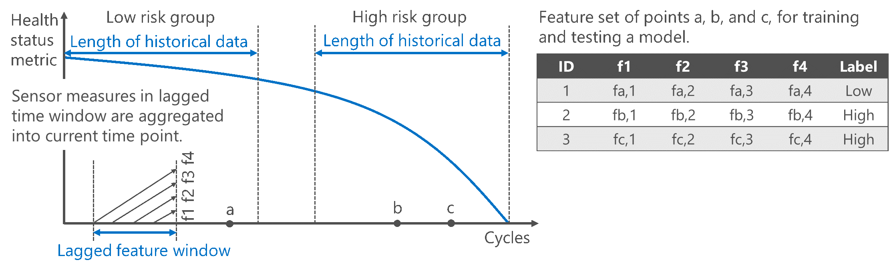

Maintaining working reliability of electrical and/or mechanical system is vital to assure quality of service and thus restrain unexpected cost. For instance, in aerospace industry, malfunction or parameter deviation of a flight component, may cause service disruption that induces huge loss. 

Predictive maintenance is proven to be efficient to forecast failure events of system component, so as to save the cost of regular maintenance visit. The conventional paradigm of predictive maintenance may refer to several data analytical problems, predicting a failure event of a machine within the next a few working cycles, predicting the Remaining Useful Life (RUL) of a machine, and so on. [Website of Microsoft Cortana Intelligence Suite](https://gallery.cortanaintelligence.com/Collection/Predictive-Maintenance-Template-3) covers a detailed introduction for predictive maintenance. 

To develop a model with best prediction power, data scientists need to work tightly with domain experts, and experiment on the observation samples with different sets of hyperparameters until one that yields the optimal results is found. Apparently scalable computation resources are required for performing such exploratory analytics, and it would be even better the analytics can be fired up on computation resources of easy control. Azure R Interface fits perfectly in solving this type of problem - it provides R based methods to invoke and manage Azure cloud instances with minimal interactions on GUI, and execute scalable analytical jobs on the deployed instances with customized computation contexts which are available in Microsoft R Server. 

In predictive maintenance scenarios, it is often a necessity to diagnose whether an equipment is working under a healthy status or not, and then proceed with further finer-grained failure predictions. False alarms produced by a failure prediction model that takes data in the most recent working cycles as input can be therefore avoided. Health status recognition considers a even longer period of cycling history of the machine. Based on the observations in training set, the model tells whether the machine is in a "healthy" status, or a "close-to-fail" status. Based on the diagnose result of health status, a failure prediction model with finer granularity of predicting interval can be then executed. 

To optimize the model performance, it is pivotal to select hyper-parameters used in both predictive models and feature engineering process. Normally there are built-in methods in model implementations for parameter fine-tuning. However, for the parameters in feature engineering which are rather specific to problems, iterative search for combination of parameters that yield the best results should be performed. For example, in an illustrative case, the health status recognition scenario, **length of time series data** and **prediction time window** are the two hyperparameters considerd in feature engineering. The following graph conceptually depicts the two parameters with an illustration of the whole life time of a machine.

 

1. *Length of time series data*. The length of time series data is the interval to sample a piece of historical time series data of an aircraft component to characterize the soft life consumption of a component at the current time point. For the high risk group samples, the time series are taken near the end of the life time of an aircraft component, while for those low risk group samples, the time series are taken near the beginning of the life time. Apparently the classification model can be easily overfitted if the length of time series data is too small. However, enlarging the window too much deteriorates the accuracy of the model as well, because a large window may cover the data series from two different risk groups. For example, data of one sensor readings in a turbo fan engine is depicted in the following figure. The overall progressing trend pattern can be partitioned into three groups according to the severity of degradation.

2. *Lagged feature window*. To consider the time-dependency of the time series data, correlation of sensor value data in the lagged time points with the current time point is also taken into consideration. The strategy is to get the statistical characteristics (e.g., rolling mean) of the historical data and aggregate them into the data at the current time point. There is also trade-offs in the lagged feature window. If the window is too small, the progressing degradation of the features over time may not be captured. However, if the window is too large, the dimensionality of the feature set for training grows which may easily lead to overfitting issues.

Considering the impacts of the two parameters on the final prediction results, data scientists who work on developing the prediction model need to experiment different sets of parameters so as to find out the optimal one. The demo in this repo demonstrates how this can be efficiently done scalably on a cluster formed by Azure [Data Science Virtual Machines](https://docs.microsoft.com/en-us/azure/machine-learning/machine-learning-data-science-provision-vm) with the help of R interface tool. 